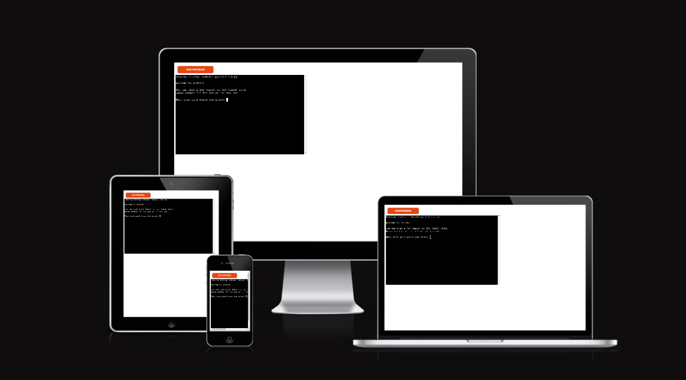

# **Sudoku**

Sudoku is a program that provides exactly what its name states. Using a command line terminal, the user can play an easy or challenging game of Sudoku. 

This program was created by my own little hobby, in which I like to play a game of sudoku to calm my mind before bed, instead of idling on social media. I hope that this game allows others like me to play, have fun and feel at peace.

Sudoku will provide an interface in which the user can input their choice in board size and difficulty, enter rows and columns in which to place their number guess and provide either a congratulatory or condolence message upon submitting their final game.

From a sudoku lover to all sudoku lovers, come and enjoy <a href="">**Sudoku**</a>.

<a href="https://sudoku-js.herokuapp.com/">**See the live version of the project here**</a>

<!-- Photo from Pixabay.com -->

# Table of Contents

* [**How To Play**](<#how-to-play>)
* [**Features**](<#features>)
    * [**Current Features**](<#current-features>)
    * [**Future Features**](<#future-features>)
* [**Data Model**](<#data-model>)
* [**Testing**](<#testing>)
    * [**Known Bugs or Issues**](<#known-bugs-or-issues>)
* [**Deployment**](<#deployment>)
* [**Credits**](<#credits>)

# How To Play

Sudoku is a game run entirely on the Command Line Interface (CLI), based on the classic pen and paper logic game.

The player is able to input words or numbers into the CLI when prompted.

The player is able to exit the application at any time by typing "quit" and pressing the enter key.

The player is prompted to choose their board size based on sudoku game complexity (either 2x2 or 3x3) and will be repeatedly prompted until a correct answer of '2' or '3' is given. 

The player is prompted for the row and column number consecutively for the cell they wish to add a number to. If the board is 2x2, this input will be a number between 1 and 4. If its a 3x3 game, the input will be a number between 1 and 9. The player can then enter a number as a guess to add to the board, which will be printed after input. The player will be prompted again if an incorrect value in inputted.

The player can input the word "submit" at any time to check their final answer. Depending on the final answer, the player will either be shown a congratulatory message with ASCII art, or a condolence message along with their final answer and the correct answer.

If the player wants to play the game again, they click on the orange button that says "Run Program"

[Return to top](<#table-of-contents>)

# Features

## Current Features

* Choice in board size and difficulty

    * The Player can input either '2' or '3' for a board size that corresponds to difficulty level.
    
    * The Player cannot enter anything other than '2' or '3' and will be prompted for another input if a number outside of the accepted numbers is entered.

    Error Message:

    

* Generates a 2x2 or 3x3 board visually in terminal

    * 2 x 2 Board:

    

    * 3 x 3 Board:

    

* Prompts and accepts user input

* Input validation and error-checking

    * The program does not accept numbers outside a sprecified range, which is dependent on board size. The user will be notified and prompted again until a correct input is taken.

    

    

* Provides a visual confirmation of user score

    * The user will be shown a congratulations or condolence message depending on whether the final board is correct.

    

    

[Return to top](<#table-of-contents>)

* ## Future Features

    * Make a larger scope sudoku class using current functions

    * Add further games for boards of both size

    * Add validation testing for inputs that aren't numbers for board size

    * Create a solver program that solves a sudoku board, instead of storing specific answers

[Return to top](<#table-of-contents>)

# Data Model 

I used a superlist, or a list of lists, as my data model, with a list being a built-in data model. The game contains two superlists in two functions, correct_answer which stores the correct answer of the final sudoku board, and sudoku_board which stores the starting sudoku board layout. A variable called board is assigned the value of sudoku_board and stores the players final game board for checking against correct_answer. 

These lists store between 4 and 9 lists depending on game size, which store the sudoku numbers in a row. 

For future development, a class named Sudoku will be made and the lists, relevant variables and functions will be stored in the class for collectrive storage and access, which was not implemented due to time constraints.

[Return to top](<#table-of-contents>)

# Testing 

I have manually tested this project by doing the following:

    * Passed the code through an AI program to check for PEP8 compliance and had no issues.

    * Given Invalid inputs: numbers outside of accepted range

    * Tested in my local terminal and the Heroku Terminal

    * Had my partner use and test the program.

* ## Bugs

    When I wrote this project, I encountered the following issues, which had since been resolved:

    * Issues inserting the contents of the list of lists into the sudoku board. I scrapped the entire function and started again from scratch, after being pointed in the right direction by fellow coders.

    * Issues printing a 2x3 sudoku board instead of 2x2. I re-wrote the section and removed the nested for and if statements originally used to create it.

    * Issues with the program raising an error when inputting row and column numbers. I added a -1 to each row and column input due to the indexing starting at 0 and not 1. 

* ## Remaining Bugs

    * No bugs remaining.

* ## Validator Testing

    * As pep8online.com was no longer available as a linter, I used githubs own coding interface PEP8 compliance tester, as well as ran the full code through an AI program to test for PEP8 compliance.

No errors were returned.

[Return to top](<#table-of-contents>)

## Deployment

This project was deployed using Heroku's terminal for applications.
    
* ### Forking the GitHub Repository

    By forking the GitHub Repository we make a copy of the original repository on our GitHub account to view and/or make changes without affecting the original repository by using the following steps...

    1. Log in to GitHub and locate the GitHub Repository
    2. At the top of the Repository (not top of page) just above the "Settings" Button on the menu, locate the "Fork" Button.
    3. You should now have a copy of the original repository in your GitHub account.

## Credits

Further credits are due to:

* [Stack Overflow](https://stackoverflow.com/) for constant reference and assistance on python code possibilities.

* Fellow python peers on the Python Discord channel, who  reviewed my code when an issue arose and provided feedback on how to resolve the issue.

* My partner, who tested the program asde from myself.

* My dad, for advice on Python code.

[Return to top](<#table-of-contents>)

    
    

